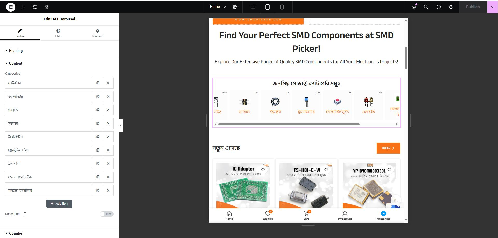

Here’s a complete `README.md` file for your Elementor custom control. It includes clear instructions, an overview, and a preview image.

---

# Sortable Checkbox Elementor Control



## Description

The **Sortable Checkbox Elementor Control** is a custom control for Elementor widgets that allows users to create a sortable list with checkboxes. This control is designed to manage item order and checkbox states efficiently while maintaining a consistent user experience.

## Features

- **Drag-and-Drop Sorting**: Easily reorder items with a simple drag-and-drop interface.
- **Persistent Data**: Saves updated order and checkbox states dynamically.
- **Customizable Options**: Each item can have a unique ID, label, and checkbox state.
- **Elementor Integration**: Seamlessly integrates with Elementor's custom control system.

## Installation

1. Clone or download this repository.
2. Place the files in your plugin directory. Use a folder structure like this:
   ```
   /my-custom-elementor-plugin/
       /assets/
           /js/
               sortable-select.js
           /css/
               sortable-select.css
           /images/
               preview/
                   1.jpg
       control-sortable-checkbox.php
   ```
3. Include the `control-sortable-checkbox.php` file in your Elementor extension/plugin.

```php
require_once plugin_dir_path(__FILE__) . 'control-sortable-checkbox.php';
```

4. Register the control in your Elementor plugin setup.

```php
add_action('elementor/controls/controls_registered', function ($controls_manager) {
    $controls_manager->register_control('sortable_checkbox', new Control_Sortable_Checkbox());
});
```

## Usage

To use this control in your Elementor widget, specify the control type as `sortable_checkbox`:

```php
$this->add_control(
    'sortable_list',
    [
        'label' => __('Sortable List', 'plugin-name'),
        'type' => 'sortable_checkbox',
        'description' => __('Drag and reorder items, and toggle their checkbox state.', 'plugin-name'),
        'default' => [
            ['id' => 1, 'checked' => true, 'index' => 1],
            ['id' => 2, 'checked' => false, 'index' => 2],
        ],
    ]
);
```

## File Structure

The plugin's file structure should look like this:

```
/assets/
    /js/
        sortable-select.js
    /css/
        sortable-select.css
    /images/
        preview/
            1.jpg
control-sortable-checkbox.php
README.md
```

## Dependencies

- **jQuery**
- **jQuery UI Sortable**
- **Elementor Editor**

Ensure these are properly enqueued by Elementor during development.

## Preview

The control appears as a sortable list with checkboxes in Elementor's custom controls. Users can easily reorder items and toggle their checkbox states.

---

Let me know if you'd like further refinements!
